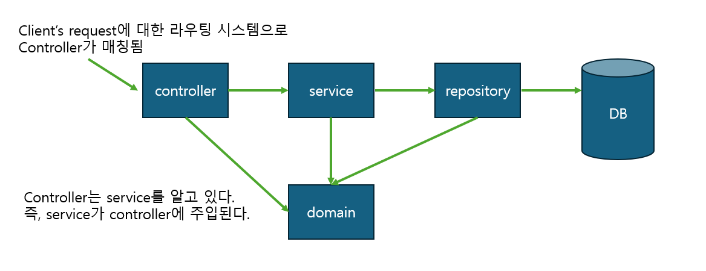
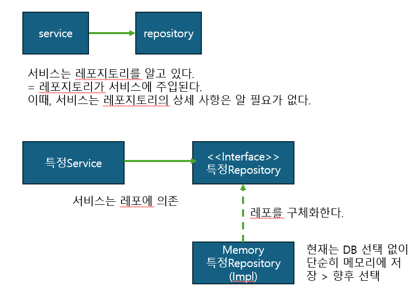

# What to Learn

---
기본적인 CRUD를 체험 해 볼 수 있는 게시판 만들기 프로젝트입니다. <br>
직접 구현하면서 배운 것들을 정리하고 메모한 파일입니다.

## 정적 컨텐츠, MVC와 템플릿 엔진, API

---
- 정적 컨텐츠는 html 파일 그대로를 보여주는 것
    - spring은 resource의 static에서 정적 컨텐츠를 찾는다.
    - 어떤 프로그래밍을 할 수 없이 그 파일을 그대로 보여준다.
- MVC와 템플릿엔진은 서버에서 데이터 등을 사용해 변형을 해서 html로 바꿔주는 것
- API는 JSON 데이터 구조 포맷으로 클라이언트에게 제공한다. 서버 끼리 통신할 때도 사용한다.

웹 브라우저에서 localhost:8080/test-static.html 으로 요청이 온다.
spring boot의 내장 톰켓 버서는 spring container에서 test-static 관련 Controller를 찾는다.
존재하지 않으니 resources:static/test-static.html을 찾는다.
존재하니 이를 웹 브라우저에 반환해준다.

### MVC, Model-View-Controller
- View는 화면에 관련된 일만한다.
- 비즈니스 로직같은 서버 뒷단에 관련된 일은 전부 컨트롤러 등에서 처리한다.
- 컨트롤러에서 뒷단에서 처리된 것을 Model에 담아서 View로 보내주는 일을 한다.
```Java
@Controller
public class HelloController {
    // localhost:8080/hello-mvc?name=spring!!!!!
    @GetMapping("hello-mvc")
    public String (@RequestParam("name") String name, Model model){
        model.addAttribute("name", name); // 파라미터로 넘어온 name을 다시 넘겨준다.
        return "hello-template";
    }
}
```
```html
<!-- resources/template/hello-template.html -->
<html xmlns:th="http://www.thymeleaf.org">
<body>
    <p th:text="'hello ' + ${name}">hello! empty</p>
</body>
</html>
```
웹 브라우저에서 localhost:8080/hello-mvc로 요청 한다.
내장 톰켓 서버는 스프링 컨테이너에서 담당 컨테이너인 helloController를 찾는다.
helloController는 hello-template과 name을 담아서 리턴한다.
viewResolver가 templates의 hello-template.html이란 view를 찾아주고 현재 사용하는 템플릿 엔진인 Thymeleaf에 넘겨준다.
템플릿 엔진이 변환을 해서 웹 브라우저에 넘겨준다.

### API
```Java
public class HelloController {
    // ...
    @GetMapping("hello-string")
    @ResponseBody // http의 body부에 retun하는 데이터를 직접 넣어준다.
    public String helloString(@RequestParam("name") String name) {
        return "hello" + name; // 이 데이터를 그대로 내려줌
    }
    // ...
}
```

```Java
public class HelloController {
    @GetMapping("hello-api")
    @ResponseBody
    public Hello helloApi(@RequestParam("name") String name){
      Hello hello = new Hello();
      hello.setName(name);
      return hello; // Json 방식으로 {"name" : "spring!!!!" } 나온다.
    }
    static class Hello {
        private String name;
        // getters and setters
    }
}
```
web browser에서 localhost:8080/hello-api를 요청한다.
내장 톰켓 서버에선 스프링 컨테이너의 적절한 컨트롤러인 helloController로 매핑시킨다.
helloController에서 해당 요청을 담당하는 메소드는 `@ResponseBody` 어노테이션되어 서 hello 오브젝트를 리턴한다.
`@Responsebody`가 붙어있으므로 viewResolver가 아니라, httpMessageConverter에게 리턴된 값을 보낸다.
바꾼 것을 요청한 웹브라우저나 서버에게 보내준다.
- ResponseBody가 사용되면 HTTP의 BODY에 문자 내용을 직접 반환한다.
- 기본 문자의 경우 StringHttpMessageConverter가 동적하고
- 기본 객체의 경우 MappingJackson2HttpMessageConverter가 동작한다.
- byte 처리 등 기타 여러 HttpMessageConverter들이 등록되어 있다.
  클라이언트의 HTTP ACCEPT 헤더와 서버의 컨트롤러 반환 타입 정보 두 개를 조합해서 HttpMessageConverter가 선택된다.

## web application's structure

---
### layer strucutre


<b>A -> B : A가 B를 알고 있다. = B는 A에 주입된다.</b>
#### 역할
- controller : web mvc's controller로 request를 적절한 응답에 매칭시킨다.
- service : 핵심 비즈니스 로직을 구현한다.
- repository : 데이터베이스에 접근한다. 도메인 객체를 데이터베이스에 저장하고 관리한다.
- domain : 비즈니스 도메인 객체 (ex. 회원, 게시글, 댓글 등)로 DB에 저장하고 관리된다.

### Dependency Injection, DI

A -> B는 A가 B에 의존한다. = A는 B를 알고 있다. = B는 A에 주입된다.<br>
- 특정 서비스는 자신의 담당 레포지토리에 의존한다.
- 그 의존 내용은 모른 채 인터페이스를 주입받는다.
- 이로써 약한 결합을 이룰 수 있다.
- 특정 레포지토리를 구체적으로 구현한 구현체가 있다.
- 현재는 DB 선택 없이 가벼운 메모리 기반 데이터 저장소에 저장한다. 앞으로 선택한다.
<br>
- Repository는 save, findById, findByTitle, findAll 같이 DB에 더 가까운 이름이 붙고
- Service는 create무언가, findOne, findOneByTitle, find무언가s 같이 비즈니스에 가까운 이름이 붙는다.

### 컴포넌트 등록, 컴포넌트 스캔으로 자동 의존 관계 설정

```Java
@Controller
public class FooController{
  //...
  private final FooService fooService;
  
  @Autowired
  public FooController(FooService fooService){
  }
}
```
- 스프링이 실행되면 그 안에 스프링 컨테이너가 생성된다.
- `@Controller` 어노테이션을 클래스에 붙인 순간, 스프링 컨테이너에 컨트롤러 객체가 생성되어 넣어진다.
- 스프링이 컨트롤러들을 관리한다.
- `@Controller`, `@Repository`, `@Service` 모두 `@Component`의 일부이다.
- `@Component`를 붙이면 스프링 빈으로 등록된다. 스프링 빈으로 등록되면 스프링 실행 시 스프링 컨테이너에 컨트롤러 객체가 생성되어 넣고 관리된다는 것을 의미한다.
<p>
마찬가지로, @Repository, @Service를 붙여주어야한다.<br>
그렇게 하면 스프링 컨테이너에 컨트롤러, 레포지토리, 서비스 어노테이션이 붙은 각 객체가 스프링 컨테이너에 등록된다.<br>
그것을 기반으로 컴포넌트 스캔을 하고 @Autowired된 경우 자동 의존 관계를 설정한다.
</p>
<p>
스프링 빈으로 등록되는 것은 현재 패키지의 Main인 @SpringBootApplication이 붙은 패키지의 하위 패키지들을 스캔한다.
</p>
<p>
스프링은 스프링 컨테이너에 스프링 빈을 등록할 때, 기본으로 싱글톤으로 등록한다.<br>
유일하게 하나만 등록해서 공유한다.<br>
따라서 같은 스프링 빈이면 모두 같은 인스턴스다. 설정으로 싱글톤이 아니게 설정할 수 있지만, 특별한 경우를 제외하면 대부분 싱글톤을 사용한다.
설정으로 싱글톤이 아니게 할 수도 있다.
</p>
## 참고자료

---
- 인프런의 김영한 선생님의 "스프링 입문 - 코드로 배우는 스프링 부트, 웹 MVC, DB 접근 기술"